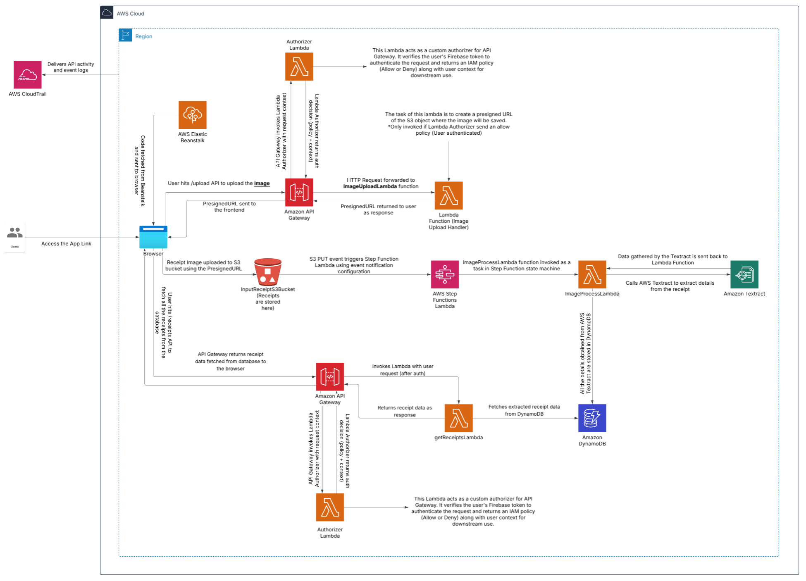

# Receiptify 📸🧾

**Receiptify** is a cloud-native serverless web app designed to extract and manage data from shopping receipts. Built as part of the **CSCI 5409: Advanced Topics in Cloud Computing** course at Dalhousie University, it showcases end-to-end cloud architecture using AWS services.

---

## 🚀 Features

- Upload receipt images securely via pre-signed S3 URLs
- Extract text using Amazon Textract and process results with AWS Lambda
- Store structured metadata in DynamoDB
- React-based frontend deployed on Elastic Beanstalk
- Secure login with Firebase Authentication + JWT validation via Lambda Authorizer
- Fully serverless backend using API Gateway, Lambda, Step Functions, and S3

---

## 🧱 Architecture Overview

- **Frontend**: React app hosted on AWS Elastic Beanstalk (Dockerized)
- **Backend**:
  - **API Gateway** + Lambda for secure endpoints
  - **Step Functions** for orchestrating Textract workflows
  - **DynamoDB** for receipt metadata
  - **S3** for image storage
- **Auth**: Firebase Authentication + custom Lambda Authorizer
- **Monitoring & Security**: CloudTrail, HTTPS, token validation, and data encryption

---

## 🔐 Security Highlights

- JWT-based auth flow
- HTTPS-secured API Gateway
- Pre-signed S3 URLs for upload
- Encryption at rest (S3, DynamoDB)
- IAM roles (least-privilege) and Secrets Manager for sensitive keys

---

## 💸 Cost Overview (Estimates for 5K Daily Users)

| Service           | Monthly Estimate |
|------------------|------------------|
| Textract          | \$225.00         |
| EC2 (Frontend)    | \$7.50           |
| DynamoDB, S3, API | \$10.00+         |
| **Total**         | **\$243.95/mo**  |

> 📉 Cost can be reduced by switching to DetectDocumentText API or integrating open-source OCR like Tesseract.

---

## 📚 Author & Credits

Built by **Shail Kardani** 

---

## 📄 License

This project was developed as part of an academic course and is for educational use only.
